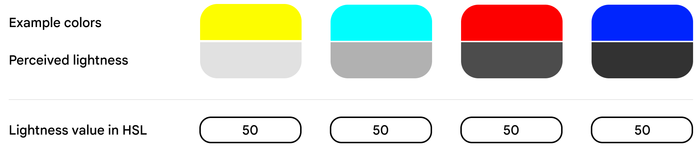
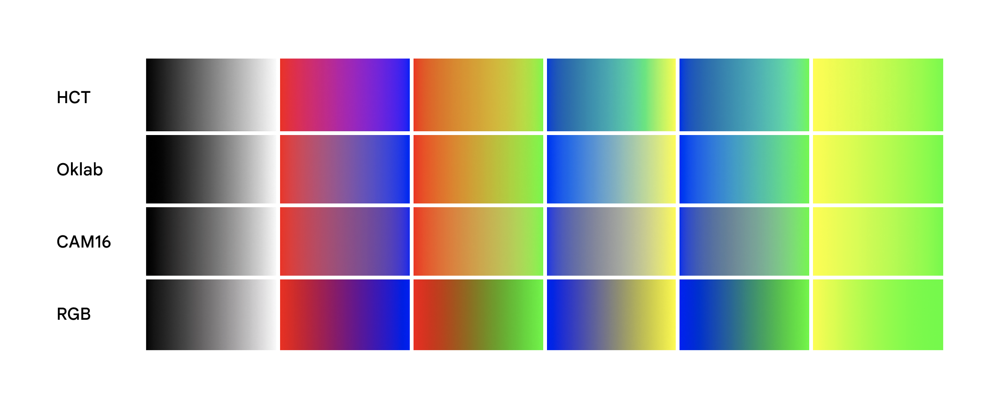
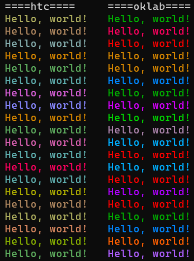
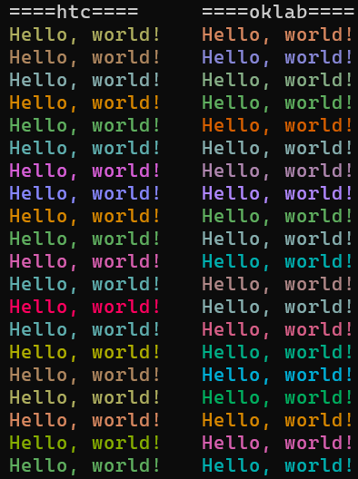
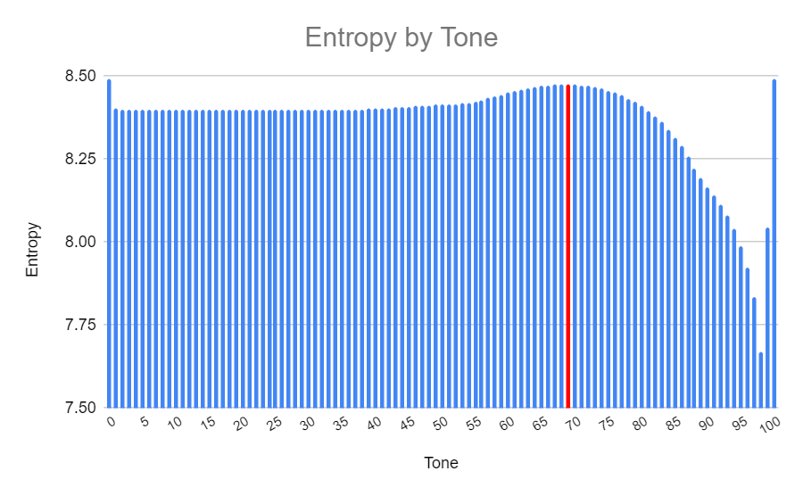
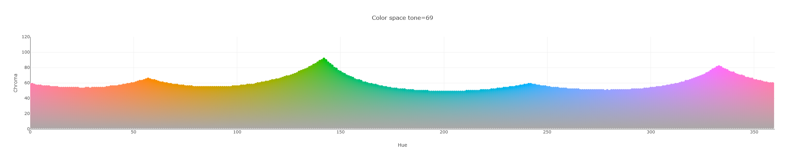
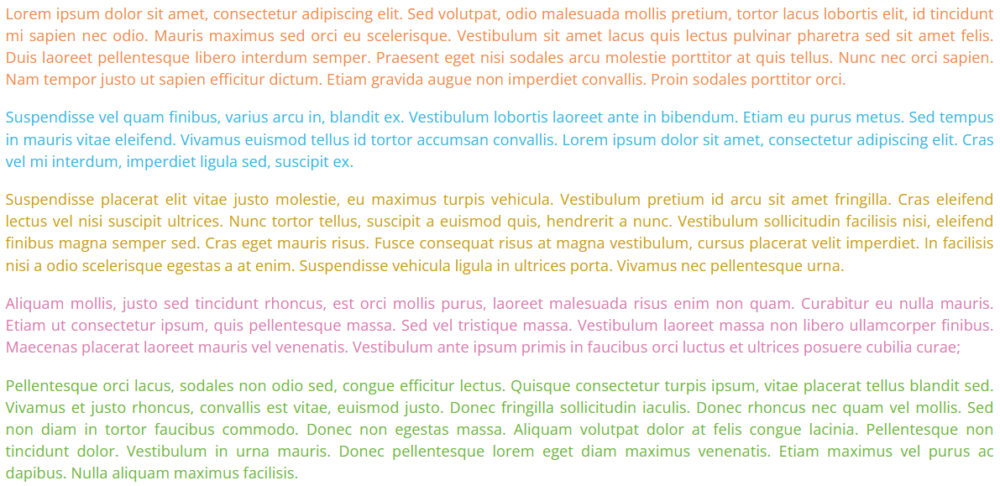
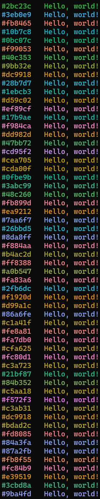
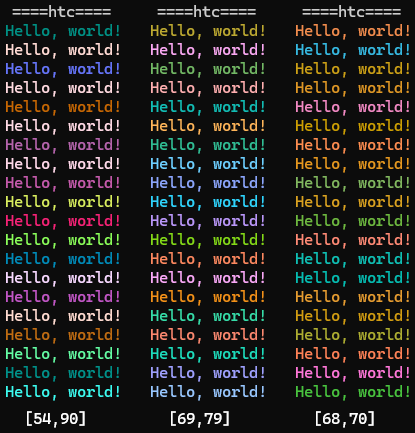
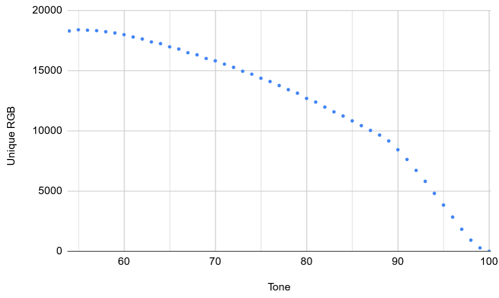

# Overview

`material-chalk` is a library for generating deterministic colors from namespaces.

I built `material-chalk` for [many reasons](README.md#problems-with-existing-implementations), one of them being that I wanted a way to generated colors for namespaces in a way that had proper justification (no "magic numbers"). To this aim, I've tried my best to justify justifications for every design choice, from the color space used to the value of the exact parameters.

# HCT as the color space

## History

RGB (red, green, blue) is one of the original color spaces used (predates computers), but is not based on human perception of colors (rather, it's based on the technical limitation of what monitors can display). In fact, in contract to sRGB ("standard RGB"), there are other standards like [P3](https://en.wikipedia.org/wiki/DCI-P3) which extend the colors that can be displayed to better cover the full range of human vision as opposed to sRGB which only represents [a subset](https://en.wikipedia.org/wiki/Color_depth#More_than_three_primaries)

However, when designing systems, we often want elements to have a consistent brightness. Generating a *random* color can easily lead to generating a value near white or black which are hard to see visually. To solve this, HSL (hue, saturation, lightness) is often used as it represents an equivalent color space to RGB (the mapping is one-to-one) which allows making the lightness a constant. However, HSL isn’t remotely accurate when it comes to human perception. In fact, it wasn't designed with this in mind - it was built to make computing colors fast on 1970s computers.

For example, here are different colors that are *obviously* different brightness, yet have the same lightness value in HSL:



To solve this problem, many have spent time trying to map the way humans see colors into a machine-representable format. To attempts to solve this are [L\*a\*b*](https://en.wikipedia.org/wiki/CIELAB_color_space) and [L\*u\*v*](https://en.wikipedia.org/wiki/CIELUV) both released in 1976 (relatively newer than RGB which predates computers). Both of these schemes are based on *L\** (Lstar) which maps to human perception of lightness uniformly, but do not provide uniformness in other dimensions (ex: hue).

In 1998, a separate [research projects](https://doi.org/10.1117/12.298269) ("Ebner-Fairchild") to try and find a more uniform hue color mapping to human perception which resulted in the [IPT](https://en.wikipedia.org/wiki/ICtCp#In_IPT) color space. However its predictions of lightness and chroma are less highly tuned.

Next, CIECAM02 (and later CAM16 in 2016) were developer to be *comprehensive* models, not only taking into account the different parameters but also the viewing conditions (ex: dark room in a cinema or outside during the afternoon).

## Modern day color spaces

Where we stand today is with two new standards:
1. (2020) [Oklab](https://bottosson.github.io/posts/oklab/)
   1. *IPT* for hue
   1. *CAM16* for chroma
   1. *CAM16* for lightness
2. (2022) [HCT](https://m3.material.io/blog/science-of-color-design) (*hue, chroma, tone*)
   1. *CAM16* for hue
   1. *CAM16* for chroma
   1. *L\*a\*c\** for lightness (which it calls *"tone"*)

It may seem like these are *similar enough* that the difference can't be that noticeable, but in practice we can see the results vary quite a bit when generating gradients:



As far as adoption goes,
- Oklab is [in CSS](https://developer.mozilla.org/en-US/docs/Web/CSS/color_value/oklab) starting in 2023, making it widely supported
- HCT is in [material 3](https://m3.material.io/) by Google, making it widely supported by many applications

Since both of these are recent and widely adopted, we focus on picking one for our use-case. Notably, **HCT's use of *L\*a\*c\** for lightness makes it easier for us to keep the lightness as a constant**.

So to choose between these two options, we need to decide which is best according to two of our criteria:
1. **Quality of the gradient**: For our use-case, we want to pick a *fixed* brightness and generate random colors with that brightness. This is essentially a gradient which, as we've seen from the picture above, looks different for Oklab and HCT. We need to pick one which looks *better* (subjective)
2. **Ease of randomness**: We want to generate random colors such that visually looking colors are as rare as possible.
3. **Mathematical basis**: We need to be able to easily justify our parameter choice (instead of picking arbitrary values).



Above I have generated random colors using both techniques using the following algorithm:
1. For HCT, I set a random *hue* and a *tone* of 54. In HCT, the *chroma* has a non-uniform maximum value depending on the *hue* and *tone*, so I find the max value for a <hue, tone> pair and set the chroma near the maximum to keep some saturation (strictly, the speaking minus [0,20])
2. For Oklab, I pick a random *a* and *b* value (between -0.4 and 0.4) and set the lightness to 0.8.

In my opinion, the oklab gradient feels less uniform in brightness, but also it feels a lot more vibrant, whereas HCT feels very uniform in brightness. To make oklab look more like HCT, we need to clamp down harder on the range of *a* and *b*.

For example, if we clamp *a* and *b* to be between [-0.2, 0.2], the results now look very similar:


So to summarize:
1. **Quality of the gradient**: **HCT wins**. It has a seemingly much more consistent gradient when it comes to picking a fixed brightness.
2. **Ease of randomness**: **oklab wins**. It is easier to generate a random color because you can just pick any *a* and *b* value in a range, whereas HCT requires more complex handling of the fact the *chroma* field is non-uniform
3. **Mathematical basis**: **HCT wins**. It feels like it has a more solid basis as it work as advertized, whereas for oklab you need to clamp the color values to get a more uniform brightness, which doesn't make intuitive sense.

Given this, we choose HCT as the color space of choice.

# Generating random HCT colors

Humans perceive different colors as having different levels of brightness. For example, we saw earlier that yellow is generally perceived as being brighter than blue. You can see this in practice in HCT, where if you look at the upper part of the possible tone values, there are more yellow colors than others.

Similarly, the possible values for `chroma` (similar to saturation) depends on the hue and the one with the range shrinking as the near the minimum and maximum tone values.


Given that we want to generate random colors with as few collisions as possible, we have to take this into account. For example, here is a naive algorithm that fails terribly:
1. Pick a random hue
2. Pick a random tone
3. Pick a random chroma within the range of possible values

The reason this does not work well is that by the time you've passed `tone=75`, there are already very few red-ish colors left which means that any hue in the red-ish range will have a high collision rate.

Therefore, we want to limit ourselves to tones that have the most balanced distribution of colors. To calculate this, we use dig in to statistics. To a given tone, if we were to pick one color at random, the probability that it's a specific hue is `number of chroma values for that hue / total number of <hue, chroma> pairs for that tone`. Now, recall that the [uniform distribution](https://en.wikipedia.org/wiki/Maximum_entropy_probability_distribution#Uniform_and_piecewise_uniform_distributions) is the most flat probability distribution possible (which is what we want), and it also [maximizes entropy](https://en.wikipedia.org/wiki/Maximum_entropy_probability_distribution#Uniform_and_piecewise_uniform_distributions). Therefore, we calculate the entropy for every tone to pick the one with the highest entropy (`-sum_for_hue(p * log2(p))` where `p` is the probability of a color being a specific hue).



Calculating the entropy for each tone gives the above graph, with entropy peaking at a tone of 69.



Notably, `tone=69` has the great property that *every* single hue has some values above `chroma=48` which is the requirement for the *"primary color"* of a [Material UI palette](https://m3.material.io/styles/color/system/overview). In fact, the tone range `[68, 70]` is the only range where this is the case.

Numbers in this range have yet another great property: the [WCAG](https://www.w3.org/TR/WCAG20-TECHS/G18.html) specification requires a contrast ratio of 4.5:1 for normal-sized text (our use-case). In *L\** (and therefore HCT tone), a ration of 4.5:1 corresponds to a *tone* difference of 50 ([source](https://github.com/material-foundation/material-color-utilities/blob/ca894db8b6aebb2833f1805ae61573c92e3f1660/typescript/hct/hct.ts#L29-L31)).

Another advantage of this tone range is that, although it's not optimized for light color schemes, the text is at least still legible.



## Summary of our parameter choice

To summarize, we numbers in the following way:
1. Pick a random hue from `[0, 360)` to allow the maximum color range
2. Pick a random tone from `[68, 70]` to ensure we get a vibrant color regardless of the hue that contrasts with a terminal background
3. Pick a random chroma from `[48, max_chroma]` where `max_chroma` depends on the `<hue, tone>` pair to ensure the color can be used as a primary color for a palette.

This choice results in the following


## Alternative parameter choices

### Choice of tone

One question that may come up is: should we really keep the tone range that small? After all, the more tones we allow, the less likely we are to get collisions. For example, you might want to extend up to `tone=90` to allow yellow colors to appear.

However, a larger range of tones leads to more jarring color differences. You can see below different color ranges where we alternative between the extremes of the range. `[54, 90]` is clearly jarring, and although `[69,79]` has a larger color range, you can visually tell there is a tone difference between entries.



There is also the problem that the number of colors available as you increase the tone decreases, and becomes more biased towards specific colors (ex: yellow and green). You can see the number of unique RGB colors for each tone below:



Without carefully picking the random point taking this into account, it can actually lead to *more* collisions, while possibly also sacrificing legibility on light themes.

### Chroma

A chroma of >= 48 is fairly strict, but we picked it to fit the primary color requirement of Material Design. 

More strictly speaking though, Material Design has a way of scoring chroma values using the following formula:

```typescript
const CUTOFF_CHROMA = 5.0;

if (hct.chroma < Score.CUTOFF_CHROMA ) {
   continue;
}

const TARGET_CHROMA = 48.0;  // A1 Chroma
const WEIGHT_CHROMA_ABOVE = 0.3;
const WEIGHT_CHROMA_BELOW = 0.1;

const chromaWeight = hct.chroma < Score.TARGET_CHROMA
    ? Score.WEIGHT_CHROMA_BELOW
    : Score.WEIGHT_CHROMA_ABOVE;
const chromaScore = (hct.chroma - Score.TARGET_CHROMA) * chromaWeight;
```

One could use this scoring algorithm to weigh the chroma value selection to enable a larger variety of chroma values. This would however, of course, stop the color chosen from being a valid primary color for a Material Design palette.

# Hash algorithm

We use [FNV-1a](https://en.wikipedia.org/wiki/Fowler%E2%80%93Noll%E2%80%93Vo_hash_function#FNV-1a_hash) because it is:
1. Fast
2. Simple to implement
3. Has a good distribution
4. Has an agreed-upon definition

You can see the distribution of FNV-1a [here](https://softwareengineering.stackexchange.com/a/145633). Murmur hash is also good, but its performance & distribution is comparable and it's [easier to get wrong](https://github.com/hajimes/mmh3/blob/8fd7f77fd7c08ec9c6da008e69f53f1e39478de1/README.md#different-results-from-other-murmurhash3-based-libraries) in different languages.
